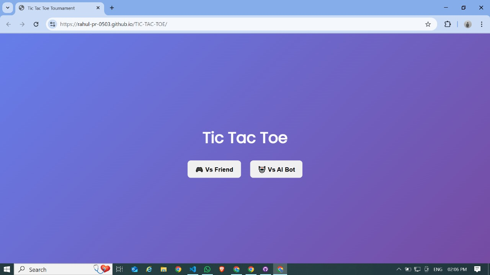
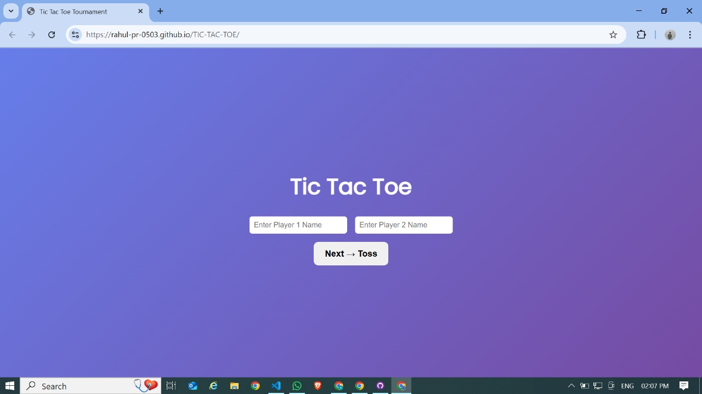
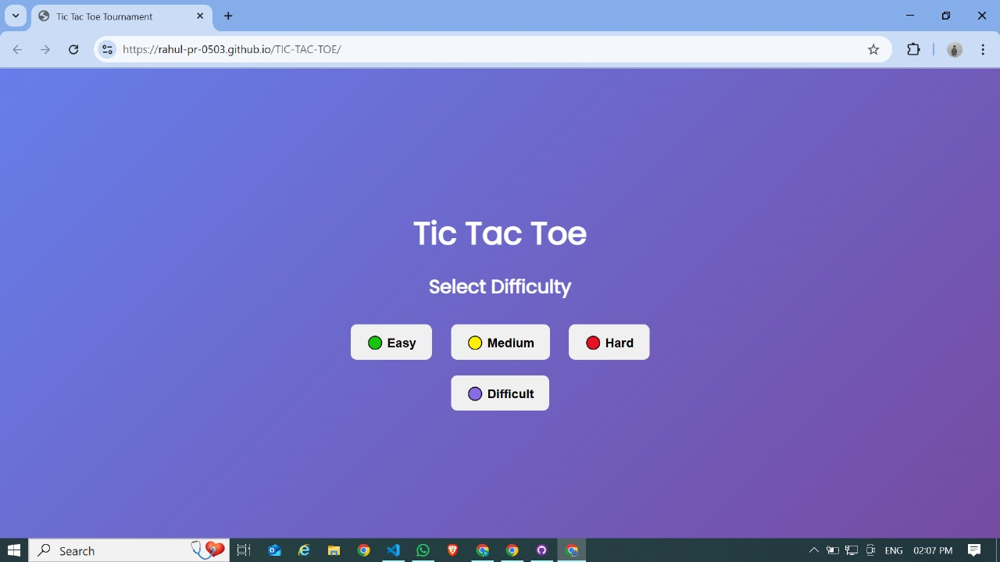
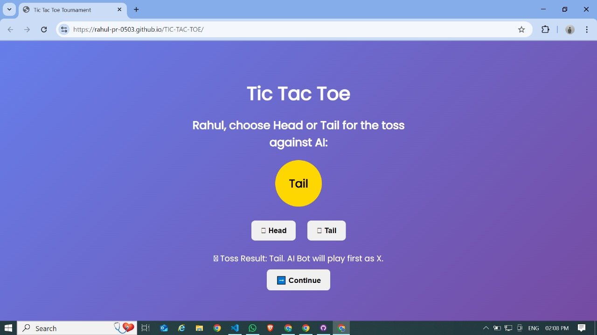
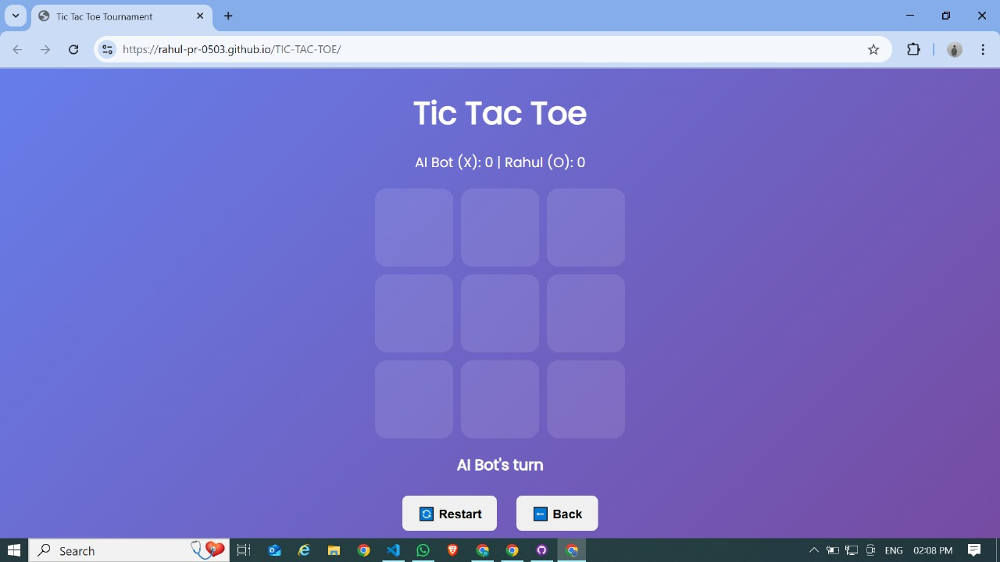

# 🎮 Tic Tac Toe Tournament

A modern **Tic Tac Toe game** built with **HTML, CSS, JavaScript, and Node.js + Socket.IO**.  
Play against a **Friend**, an **AI Bot** (with multiple difficulty levels), or challenge others in **Online Mode**.

---

## 🚀 Features

- 🎮 **Play Modes**

  - Vs Friend (local multiplayer)
  - Vs AI Bot (Easy / Medium / Hard / Difficult with Minimax AI)
  - Online Mode (Create Room / Join Room / Random Match)

- 🪙 **Toss System**  
  Players flip a coin to decide who goes first as **X**.

- 🏆 **Tournament Mode**  
  First to win **3 rounds** becomes the champion!

- 📊 **Scoreboard**  
  Keeps track of wins across multiple rounds.

- 🎨 **Modern UI**  
  Responsive layout with smooth hover effects and coin-flip animation.

---

## 🖼️ Screenshots

### Main Menu



### MultiPlayer



### AI BOT



### Toss Screen



### GamePlay

## 

## 🛠️ Tech Stack

- **Frontend:** HTML5, CSS3, Vanilla JavaScript
- **Backend:** Node.js, Express (optional), Socket.IO
- **Realtime:** WebSockets (via Socket.IO)

---

## 📂 Project Structure

├── index.html # Main game UI
├── style.css # Styling (responsive + animations)
├── script.js # Frontend game logic (AI, toss, UI updates)
├── server.js # Node.js + Socket.IO server for online mode
├── assets/ # (optional) images/screenshots
└── README.md # Project documentation

---

## ⚡ Installation & Setup

### 1️⃣ Clone the Repository

```bash
git clone https://github.com/Rahul-pr-0503/TIC-TAC-TOE.git
```
